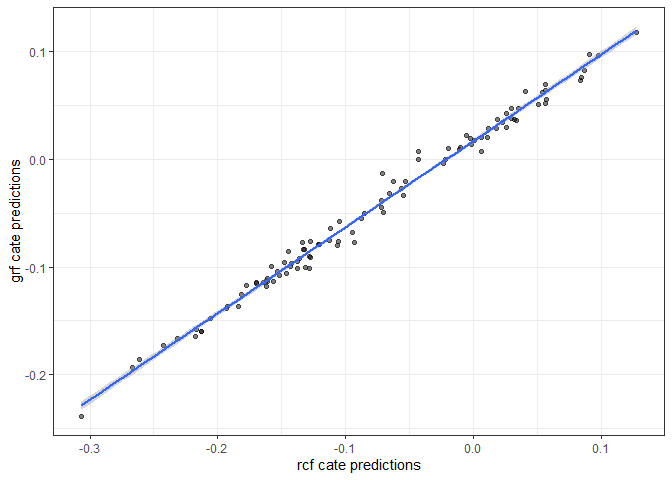

<!-- README.md is generated from README.Rmd. Please edit that file -->

# rcf

<!-- badges: start -->

<!-- badges: end -->

rcf is a simplified fully R based implementation of causal forests based
on some features of Julie Tibshirani’s, Susan Athey’s, Stefan Wager’s
and the grf lab team’s causal forest functionality
(<https://grf-labs.github.io/grf/>). This was always meant to be a fun
project to get stuck into the workings of the algorithm and try to get
to grips with the theory behind it (as far as I understood it) a bit
better by just trying to build the functions from scratch. I wouldn’t
suggest using this (for any high stakes work at least) for the following
reasons:

1.  this is really just an experimental implementation of my
    understanding of the grf causal forest algorithm
2.  the functionality is much more limited than what grf offers

That being said when running these causal forest functions and the grf
implementation on the same data the results are quite similar (same
ballpark when looking at correlations between conditional average
treatment effect estimates produced by both implementations). So if you
prefer working in R and want to experiment around with some causal
forest code hopefully this is somewhat useful.

##### References and Reading:

Rina Friedberg, Julie Tibshirani, Susan Athey, and Stefan Wager. Local
Linear Forests. 2018 (<https://arxiv.org/abs/1807.11408>)

Stefan Wager and Susan Athey. Estimation and Inference of Heterogeneous
Treatment Effects using Random Forests. Journal of the American
Statistical Association, 113(523), 2018.
(<https://arxiv.org/abs/1510.04342>)

Susan Athey and Stefan Wager. Estimating Treatment Effects with Causal
Forests: An Application. Observational Studies, 5, 2019.
(<https://arxiv.org/abs/1902.07409>)

Susan Athey, Julie Tibshirani and Stefan Wager. Generalized Random
Forests. Annals of Statistics, 47(2), 2019.
(<https://arxiv.org/abs/1610.01271>)

## Installation

You can install the development version of rcf from
(<https://github.com/>) with:

``` r
devtools::install_github("till-tietz/rcf")
```

## Usage

``` r
# generate some data
data <- as.data.frame(do.call(cbind, replicate(10, rnorm(100), simplify=FALSE)))
data[["treat"]] <- rbinom(nrow(data),1,0.5)
vars <- colnames(data)[1:(ncol(data)-2)]

# set up parallel processing 
future::plan("multisession")

# build causal forest 
cf <- rcf::causal_forest(n_trees = 1000, data = data, outcome = "V10",
                         covariates = vars, treat = "treat", minsize = 5,
                         alpha = 0.05, feature_fraction = 0.5, sample_fraction = 0.5,
                         honest_split = TRUE, honesty_fraction = 0.5)

# predict cates
cate <- rcf::predict_causal_forest(data = data, cf = cf, predict_obb = TRUE)
```

predict\_causal\_forest returns a data.frame of observation ids and cate
estimates

| obs\_id |        cate |
| ------: | ----------: |
|       1 | \-0.1917451 |
|       2 | \-0.1024732 |
|       3 | \-0.1354575 |
|       4 | \-0.1399241 |
|       5 | \-0.1071271 |
|       6 | \-0.1954411 |
|       7 | \-0.0700747 |
|       8 | \-0.0337245 |
|       9 | \-0.1548139 |
|      10 | \-0.0761274 |

variable\_importance generates a data.frame of variable importance
metrics

``` r
var_importance <- rcf::variable_importance(cf = cf, covariates = vars, n = 4, d = 2)
```

| variable | importance         |
| :------- | :----------------- |
| V3       | 0.0920672507695951 |
| V5       | 0.0886573525929434 |
| V9       | 0.0886573525929434 |
| V2       | 0.0869524035046176 |
| V4       | 0.0869524035046176 |
| V6       | 0.0767227089746626 |
| V1       | 0.0716078617096851 |
| V8       | 0.0562633199147526 |
| V7       | 0.0545583708264267 |

## Performance compared to grf

We’ll build 500 grf and rcf causal forests respectively and compare the
means of their cate predictions for each observation.

``` r
grf_sim <- function(x){
  grf <- grf::causal_forest(X = data[,vars], Y = data[,"V10"], W = data[,"treat"],
                            num.trees = 1000,mtry = 5, min.node.size = 5,
                            honesty = TRUE, honesty.fraction = 0.5, alpha = 0.05)
  
  results <- as.data.frame(t(predict(grf)[["predictions"]]))
  return(results)
}

results_grf <- furrr::future_map_dfr(1:500, ~grf_sim(.x), .progress = TRUE)%>%
  dplyr::summarise_all(mean)%>%
  t()

rcf_sim <- function(x){
  cf <- rcf::causal_forest(n_trees = 1000, data = data, outcome = "V10",
                           covariates = vars, treat = "treat", minsize = 5,
                           alpha = 0.05, feature_fraction = 0.5, honest_split = TRUE,
                           honesty_fraction = 0.5)
  
  results <- as.data.frame(t(rcf::predict_causal_forest(data = data, cf = cf, predict_obb = TRUE)[["cate"]]))
  return(results)
}

results_rcf <- furrr::future_map_dfr(1:500, ~rcf_sim(.x), .progress = TRUE)%>%
  dplyr::summarise_all(mean)%>%
  t()
```

The rcf cate predictions match those generated by grf relatively well.



## Performance compared to other methods

We’ll test the performance of the rcf causal forest against a linear
regression and knn approach to estimating heterogeneous treatment
effects. We’ll use a simulated data set with explicit treatment effect
heterogeneity across two variables.


## Methodology

### Explicitly Optimizing Heterogeneity

rfc serves as an estimator for conditional average treatment effects by
explicitly optimizing on treatment effect heterogeneity. This is
achieved by recursively splitting a sample such as to maximize the
following quantity of interest:


Mean squared difference in treatment effects 𝜏 across sub-samples
created by a set of all possible partitions of a sample 𝑃 minus the sum
of variances in outcomes for treatment and control units summed across
sub-samples. The two components of the equation are weighted by the
parameter 𝛼.

### Algorithm

1.  Draw a sample of size = n data \* feature\_fraction without
    replacement
2.  If honest\_split is TRUE, split this sample into a tree fitting
    sample of size = n sample \* (1 – honesty\_fraction) and an honest
    estimation sample of size = n sample \* (honesty\_fraction)
3.  Draw a sample of covariates of size = n covariates \*
    feature\_fraction
4.  Find unique values of all sampled covariates in the tree fitting
    sample
5.  Split the tree fitting sample at each unique value and assess if
    there are n \> minsize treatment and control observations in each
    sub\_sample created by the split (keep only those split points where
    the minsize requirement is met)
6.  For each valid split point compute EQ 1 (variance of treatment
    effects across sub-samples minus sum of variances in outcomes for
    treatment and control units in each sub-sample). Choose the split
    that maximizes this value.
7.  Keep recursively splitting each sub-sample of the tree fitting
    sample until no split can satisfy the minsize requirement. The tree
    is fully grown at this point.
8.  Push the honest estimation sample down the tree (i.e. subset the
    honest estimation sample according to the splitting rules of the
    tree grown with the tree fitting sample). In each terminal leaf
    compute the average treatment effect with the honest estimation
    sample observations. These average treatment effects become the CATE
    estimates for each terminal leaf.
9.  Repeat 1-8 n\_trees times.
10. Push a test sample down each tree in the forest (i.e. subset the
    test sample according to the splitting rules of each tree in the
    forest). Record honest CATE estimates of all leaves a test sample
    observation falls into. Compute the mean of all these honest CATE
    estimates. This is the CATE for the given observation.

### Variable Importance

Variable Importance is computed as a weighted sum of how often a
variable was split at depth k within a tree.


